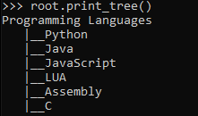
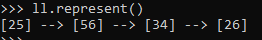
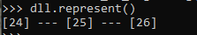
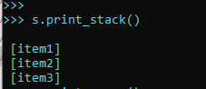
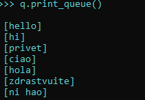

# SimpleDS:

---

### Library Description

A simple library with built in data structures like linked lists, doubly linked lists, stacks, queues, trees and binary search trees to help beginners to quickly operate and visualize them.

### To use the library:

1) move the simpleds.py file to the folder in which the file in which you want to import it lies. 

2) Once done the first step, type in your file: 
> from simpleds import *

---

### Create Data Structures:

---

### Create Trees:

First of all, create a root.

> root = TreeNode("value")

Then, create other nodes if you want to:

> node1 = TreeNode("value")

To link them:

> root.add_child(node1)

#### Visualize Trees:

> root.print_tree()

Output Example:

---

### Create Linked Lists:

---

First of all, create a linked list:

> ll = LinkedList()

---

- To insert nodes, you can insert them at the beginning, at the end, or at a particular index. Indexes start from 0 too in this data structure. 

-At the beginning:

> ll.insert_at_beginning("value")

-At the end:

> ll.insert_at_end("value")

-At a certain index:

> ll.insert_at("index", "value")

- You can also pass an array with this method. The linked list will insert the values at the same index in which they are in the array.

> ll.insert_values("data_array")

EXAMPLE:

> data = [22,23,24,25]

> ll = LinkedList()

> ll.insert_values(data)

> ll.represent()

Output: [22] --> [23] --> [24] --> [25] 

---

- To remove nodes, you can either remove them at the beginning, at the end or at a particular index.

-At the beginning:

> ll.remove_at_beginning()

-At the end:;

> ll.remove_at_end()

-At a particular index:

> ll.remove_at("index")

---

- To get the length of a linked list:

> ll.get_length()

---

- To get a visual representation of your linked list:

> ll.represent()

EXAMPLE OUTPUT:

- To get the type of each element of a linked list:

> ll.type_each()

OUTPUT: an array containing the data type of each element of the linked list.

### Create Doubly Linked Lists:

---

- To create a doubly Linked list:

> dll = DoublyLinkedList()

Most of the methods following are very similar to those of the linked list. The only difference is that every node of a doubly linked list will be linked to both the previous and next element. 

One of the few differences is the represent method, that will return a different representation , without arrows pointing the direction , because as we said before the node is linked with both previous and next element:

> dll.represent()

EXAMPLE OUTPUT:

### Create Stacks:

---

- To create a stack:

> s = Stack()

---

- To add an element to a stack:

> s.push("item")

---

- To add many elements to a stack:

> s.push_many("item array") 

EXAMPLE:

> s.push_many(["item1", "item2"])

---

- To remove an element from a stack:

> s.pop()

---

- To remove all elements from a stack:

> s.clear()

---

- To return the size of a stack:

> s.size()

---

- To represent the stack graphically:

> s.print_stack()

EXAMPLE REPRESENTATION:

---

- To return an array containing all the elements of the stack. 

> s.to_array()

---

-To do the same with a string:

> s.to_string()

---

### Create Queues:

---

- To create a queue:

> q = Queue()

---

- To add an element to a queue:

> s.enqueue("item")

---

- To add many elements to a queue:

> q.enqueue_many("item array") 

EXAMPLE:

> q.enqueue_many(["item1", "item2"])

---

- To remove an element from a queue:

> q.dequeue()

---

- To remove all elements from a queue:

> q.clear()

---

- To return the size of a queue:

> q.size()

---

- To represent the queue graphically:

> q.print_queue()

EXAMPLE REPRESENTATION:

---

- To return an array containing all the elements of the queue. 

> q.to_array()

---

-To do the same with a string:

> q.to_string()

---

Licensed under: [MIT](LICENSE)
 
